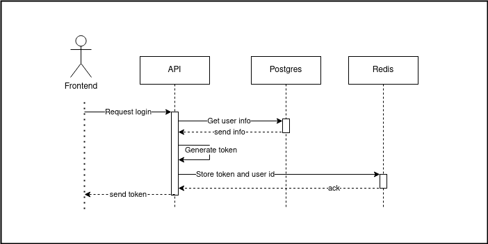
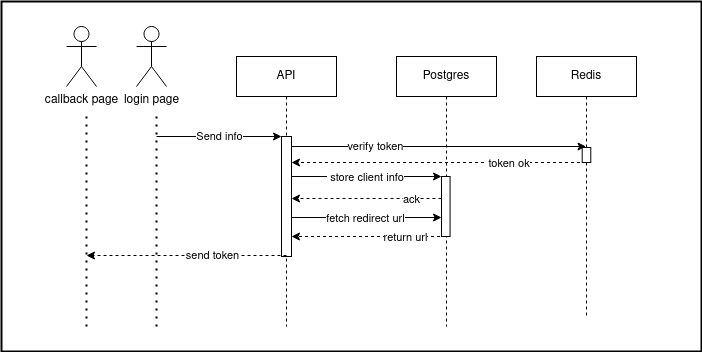

# Authrex Node
An authentication as a service provider made using express and postgresql. This project aims to showcase my skills in backend development.

# Project Planning
- [x] `/signup`
for signing up a new user or a new client
- [x] `/login`
for logging in a user or a client
- [ ] `/options`
for getting the login options of a specified user
- [ ] `/redirect`
fetches the redirect url of the specified user
- [x] `/token` generates a temporary token for the login process
- [X] `/key` generates a new API key for the user

# Design Decisions
1. Using postgresql as the database
2. Using express as the server
3. JSDocs for type inference
4. ESLint for code formatting
5. Jest for unit testing
6. Redis for token storage

---
## User signup and login 

`/signup?type={user,client}` has two types of users: `user` and `client`. A user is a person who wants to use the product as a service. A client is a person who uses the user's service. For example, a user can be a company and clients can be the users of the company.

Implementing user type first since the project starts with a user signing up. Signing up should create a new user.Storing hashed passwords instead of plain text, this increases security. I have also salted every passwords before hashing to prevent any rainbow table attacks.

Login route returns a JWT token which contains user id in it. This token is used for other route authentication. The token is signed usingg a secret key to avoid cookie tampering which can lead to unauthorized access.

I decided to add a new middleware called `verifyUser` to check if the incoming api request from a client is linked to a real user or not. I decided to use a middleware because this process of verifying a valid user is done in multiple client routes.

## Client signup and login

When a client wants to signup or login, they must be initiated by an user. The user must request for a temporary token from the server in order to initiate the client signup/login process. The token generation process goes like this:

1. User requests for a temporary token from the server
2. Server generates a temporary token and stores it in redis
3. Server sends the temporary token to the user
4. User directs the client to the `/login` or `/signup` page with the temporary token as a query parameter

Now the login page will get client's login information and the temporary token from the query parameter and follows the process below:

1. Client sends the login information to the server
2. Server verifies token
3. Server verifies/creates client login information
4. Server sends a JWT token to the callback url of the user

## API key generation
The `/key` routes lets an user to generate or refresh their API key, the key is 16 bytes hex string which is used by the SDK to authenticate the user. The API key is stored in the database.